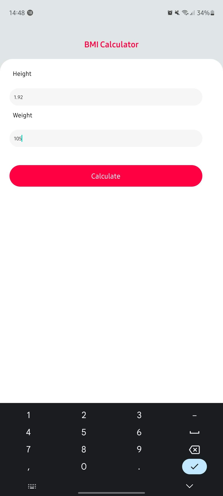
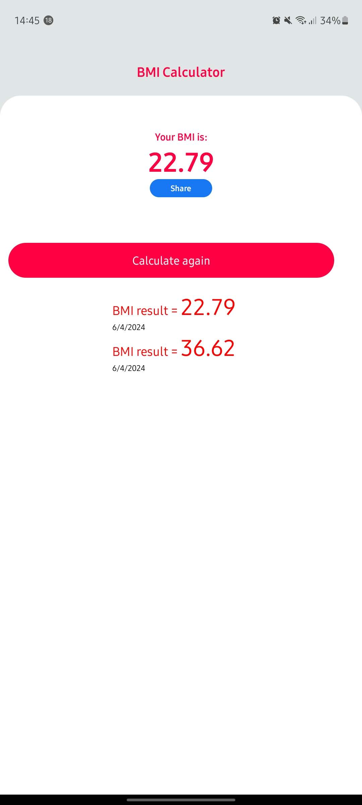

# BMI Calculator

This is a solution to the Body Mass Index developed with [One Bit Code YT channel](https://www.youtube.com/@OneBitCode) mentorship, which help me improve my coding skills in React Native by building realistic project.

## Table of contents

- [Overview](#overview)
  - [The challenge](#the-challenge)
  - [Screenshot](#screenshot)
- [My process](#my-process)
  - [Built with](#built-with)
  - [What I learned](#what-i-learned)
- [Author](#author)

## Overview

### The challenge

Users should be able to:

- Calculate your own BMI
- See results history and compare your evolution
- Share your results

### Screenshot





## My process

### Built with

- React Native
- CSS - for Styles

### What I learned

In this project, I learnt React Native concepts about its structure and rules for building a functional application.

I'd like to share some important learnings

Vibration API application:

```js
const verificationBmi = () => {
  if (bmi === null) {
    Vibration.vibrate();
    setErrorMessage("Required Field*");
  }
};
```

FlatList comprehension:

```js
<FlatList
  showsVerticalScrollIndicator={false}
  style={style.listBmi}
  data={bmiList.slice().reverse()}
  renderItem={({ item }) => {
    return (
      <>
        <Text style={style.resultBmiItem}>
          BMI result = <Text style={style.textResultItemList}>{item.bmi}</Text>
        </Text>
        <Text>{`${getDate(item.id)}`}</Text>
      </>
    );
  }}
  keyExtractor={(item) => item.id}
/>
```

Share Api affectation:

```js
    function ResultBmi(props) {
    const onShare = async () => {
        const result = await Share.share({
        message: `My BMI today is: ${props.resultBmi}`,
        });
    };
```

## Author

- linkedIn - [Mikael Espínola](https://www.linkedin.com/in/mikaelespinola)
- E-mail - [GMAIL](mailto:mikaelespinolaa@gmail.com)
